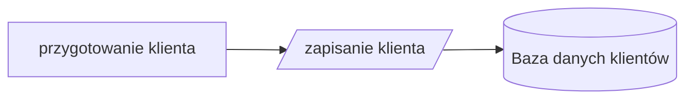
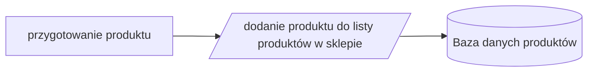
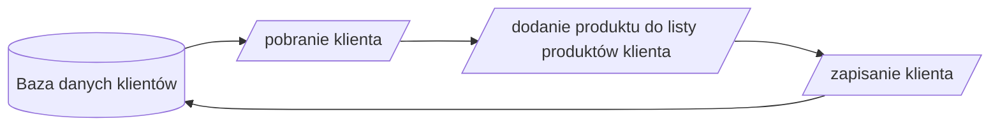
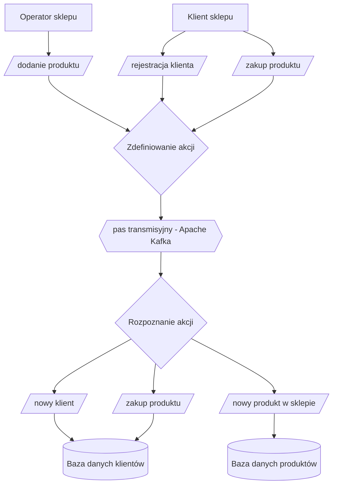

# Sklep zdarzeniowy

Projekt to *proof of concept* sklepu opartego o rozproszoną architekturę i komunikację poprzez Kafkę. Bardziej precyzyjny opis znajduje się na [blogu]( https://blog.prokulski.science/2022/04/26/sklep-rozproszony/).

W sklepie mogą się pojawić przykładowe zdarzenia:

+ operator sklepu dodaje produkt do listy dostępnych w sklepie produktów
+ klient rejestruje się w sklepie i od teraz może robić zakupy
+ klient kupuje produkt i tym samym dodaje go listy posiadanych rzeczy

## Użycie

1. Klonujemy repozytorium przez komendę `git clone https://github.com/prokulski/ClientFlow.git`
1. Wchodzimy do głównego folderu repozytorium (komenda `cd client_flow`)
1. Tworzymy środowisko wirtualne (Python 3.9+) np. przez `virtualenv venv`
1. Aktywujemy środowisko wirtualne przez `source venv/bin/activate`
1. Instalujemy potrzebne pakiety przez `pip install -r requirements.txt`
1. Uruchamiamy potrzebne komponenty (Apache Kafka + MongoDB) przez `docker-compose up`
1. Uruchamiamy w oddzielnym oknie konsoli konsumenta komunikatów przychodzących Kafką i przepisujących je do bazy danych przez `python tools/kafka_read.py`
1. Otwieramy kolejne okno konsoli, w którym będzie można uruchamiać poniżej wymienione komendy.
1. Konfiguracja jest w pliku `config.yaml` - zmiana brokera Kafki, dostępu do bazy danych i tak dalej odbywa się tam. Warto jednak przejrzeć przed zmianami `utils/config.py` i zobaczyć co oznaczają poszczególne pola w YAMLu.

### Stworzenie klientów

Na początek potrzebujemy przykładowych klientów. Tworzymy ich przez `python tools/make_customers_db.py` (bezpośrednio w bazie danych) lub przez `python tools/make_customers_kafka.py` (za pośrednictwem Kafki).

Listę klientów możemy podejrzeć przez `python tools/list_customers.py` - skrypt ten nie korzysta z Kafki, czyta bezpośrednio z bazy.

### Stworzenie produktów

Podobnie tworzymy przykładowe produkty dostępne w sklepie `python tools/make_products_db.py` (od razu w bazie) lub `python tools/make_products_kafka.py` jeśli chcemy to puścić przez Apache Kafka.

Listę dostępnych produktów zobaczymy dzięki `python tools/list_products.py`. Skrypt - podobnie jak ten dla klientów - czyta bezpośrednio z bazy danych.

### Zakupy przez klientów

Klienci mogą kupić produkty (losowi klienci kupują losowe produkty) - co wydarzy się kiedy uruchomimy `python tools/customers_buys_products_db.py` lub drogą Kafkową `python tools/customers_buys_products_kafka.py`.

Zmiany w posiadaniu produktów zobaczymy przez ponowne uruchomienie `python tools/list_customers.py`

## Flowchart całego procesu

