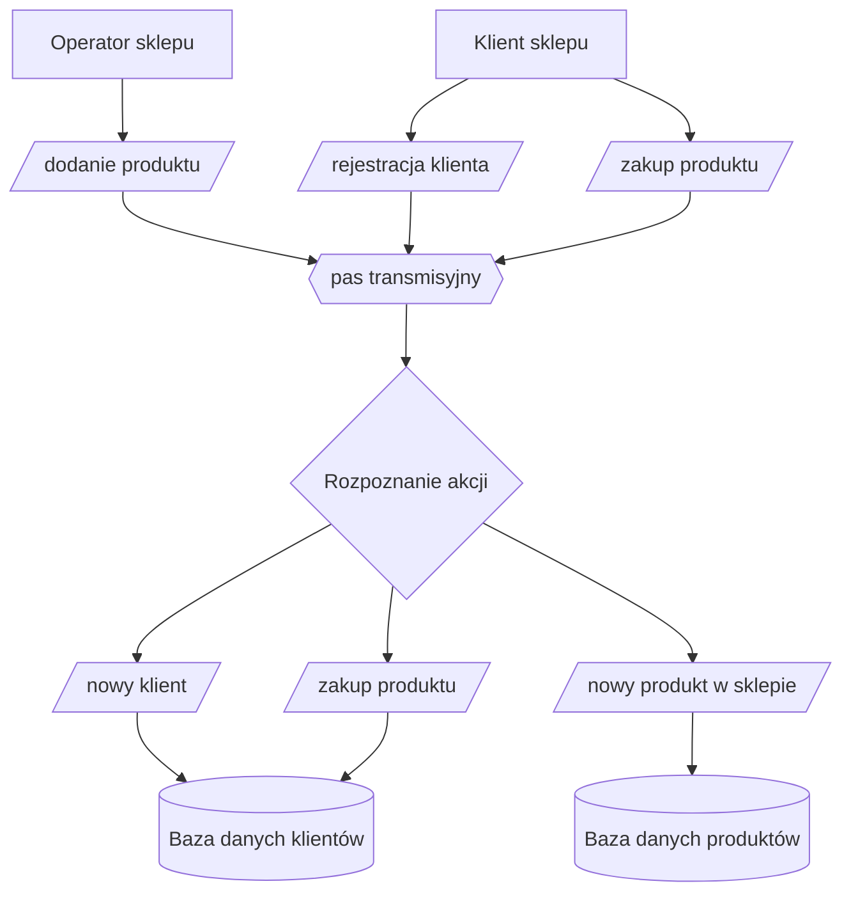
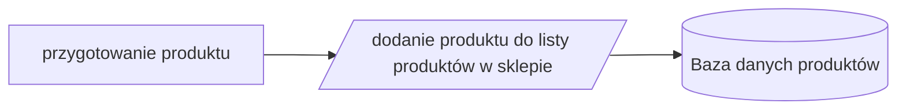
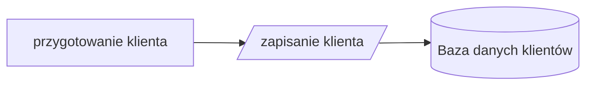
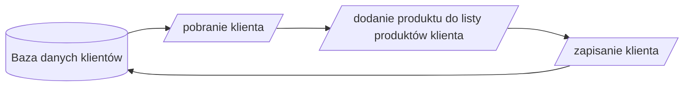

# Flow

Coś generuje różne eventy na kafkę

+ nowy produkt
+ nowy klient
+ klient kupuje produkt

Coś innego odbiera te eventy i odpowiednio na nie reaguje:

+ dodaje produkt do listy dostępnych produktów
+ dodaje klienta do listy klientów
+ dodaje produkt do listy kupionych przez klienta rzeczy

## Flowchart całego procesu

## Dodanie produktu do oferty sklepu

## Rejestracja klienta w sklepie

## Zakup produktu przez klienta

