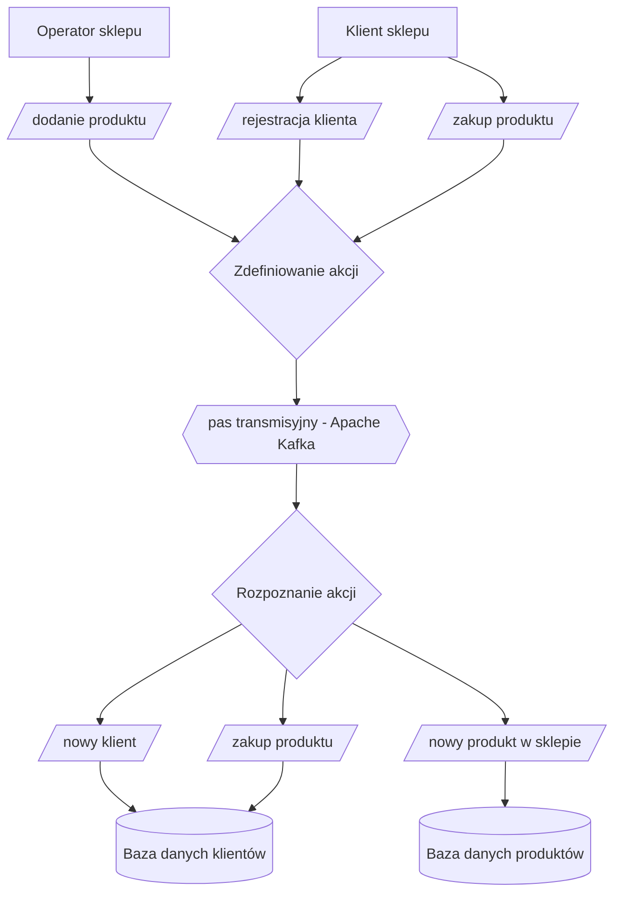
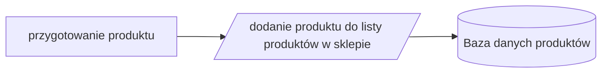
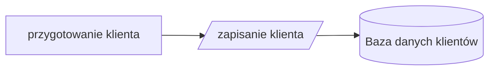
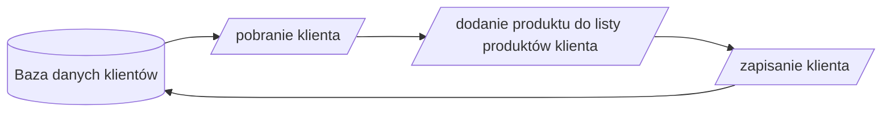

# Sklep zdarzeniowy

Projekt to *proof of concept* sklepu opartego o rozproszoną architekturę i komunikację poprzez Kafkę. Bardziej precyzyjny opis znajduje się na [blogu](https://blog.prokulski.science).

W sklepie mogą się pojawić przykładowe zdarzenia:

+ operator sklepu dodaje produkt do listy dostępnych w sklepie produktów
+ klient rejestruje się w sklepie i od teraz może robić zakupy
+ klient kupuje produkt i tym samym dodaje go listy posiadanych rzeczy

## Użycie

1. Klonujemy repozytorium
1. Tworzymy środowisko wirtualne (Python 3.9+) np. przez `virtualenv venv`
1. Aktywujemy środowisko wirtualne przez `source venv/bin/activate`
1. Instalujemy potrzebne pakiety przez `pip install -r requirements.txt`
1. Uruchamiamy potrzebne komponenty (Apache Kafka + MongoDB) przez `docker-compose up -d`

### Stworzenie klientów

Na początek potrzebujemy przykładowych klientów. Tworzymy ich przez `python tools/make_customers_db.py`

Listę klientów możemy podejrzeć przez `python tools/list_customers.py`

### Stworzenie produktów

Podobnie tworzymy przykładowe produkty dostępne w sklepie `python tools/make_products_db.py`

Listę dostępnych produktów zobaczymy dzięki `python tools/list_products.py`

## Flowchart całego procesu

Działanie poszczególnych zdarzeń w szczegółach opisują kolejne punkty.

### Dodanie produktu do oferty sklepu

### Rejestracja klienta w sklepie

### Zakup produktu przez klienta

